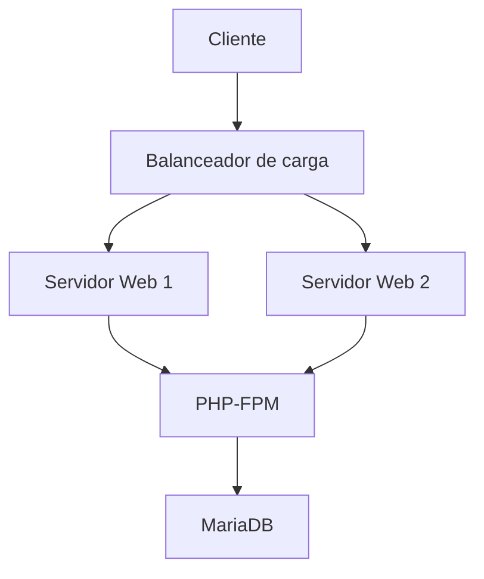

# CMS con arquitectura en capas de alta disponibilidad

Curso: Aplicaciones Web
Fecha de entrega: 17 de diciembre de 2024 0:00 (CET)
Confidencial: Confidencial
Última Edición: 16 de diciembre de 2024 20:39

# Introducción 📘

En este repositorio se encuentra la documentación técnica en la cual se describe el proceso de despliegue de una infraestructura basada en capas para alojar Owncloud en alta disponibilidad y con la capacidad de poder ser escalable con el tiempo, se despliega gracias a la herramienta Docker. La infraestructura incluye balanceo de carga, servidores web, un motor PHP-FPM y un servidor de base de datos. 

Esta infraestructura garantiza la alta disponibilidad mediante el balanceo de carga, escalabilidad al permitir añadir mas servidores web en caso de que sea necesario y aislamiento entre capas para mejorar la seguridad. 

El vídeo te lo he enviado por drive mediante un enlace a tu correo.

# Arquitectura de la infraestructura 🏗️

1. Capa pública con un balanceador de carga con Nginx, posee acceso al exterior y acceso a la capa de los servidores web. 
2. Capa privada con dos servidores web Nginx y un motor de PHP-FPM el cual es necesario para el funcionamiento de owncloud.
3. Capa privada con un servidor MariaDB para el almacenamiento de datos. 

Además, los servidores web poseen un volumen compartido el cual se utiliza para compartir datos entre estos. 

# Requisitos previos para realizar la infraestructura 🛠️

- Motor de Docker
- Herramienta Docker Compose

# Estructura interna del proyecto 📂

El proyecto se organiza de la siguiente manera:

```
proyecto/
├── README.md
├── docker-compose.yaml
├── balanceador_web/
│   ├── default
│   ├── Dockerfile
│   ├── nginx.conf
│   └── certs/
│       ├── cert.pem
│       └── key.pem
├── nginx-conf/
│   └── default.conf
├── php_fpm/
│   ├── default
│   ├── Dockerfile
│   └── setup-owncloud.sh
├── web1/
│   ├── default
│   ├── Dockerfile
│   └── setup-owncloud.sh
└── web2/
    ├── default
    ├── Dockerfile
    └── setup-owncloud.sh
```

# Configuración ⚙️

## Docker Compose

El archivo docker-compose.yml define los servicios, redes y volúmenes necesarios para nuestra infraestructura:

```yaml
services:
  balanceador_web_jorge:
    build:
      context: ./balanceador_web  # Ruta del contexto de construcción para el balanceador de carga
    container_name: balanceador_web_jorge  # Nombre del contenedor
    ports:
      - "80:80"  # Mapea el puerto 80 del host al puerto 80 del contenedor
      - "443:443"  # Mapea el puerto 443 del host al puerto 443 del contenedor
    volumes:
      - ./balanceador_web/nginx.conf:/etc/nginx/nginx.conf  # Monta el archivo de configuración de nginx
      - ./balanceador_web/certs:/etc/nginx/certs  # Monta el directorio de certificados
    depends_on:
      - php_fpm_jorge  # Depende del servicio php_fpm_jorge
    networks:
      frontend:  # Conectado a la red frontend
      backend_web:
        ipv4_address: 172.16.2.10  # Dirección IP fija en la red backend_web

  web1_jorge:
    build:
      context: ./web1  # Ruta del contexto de construcción para el primer servidor web
    container_name: web1_jorge  # Nombre del contenedor
    volumes:
      - shared_web:/var/www/html  # Monta el volumen compartido para el contenido web
    depends_on:
      - db1_jorge  # Depende del servicio db1_jorge
      - php_fpm_jorge  # Depende del servicio php_fpm_jorge
    ports:
      - "81:80"  # Mapea el puerto 81 del host al puerto 80 del contenedor
    networks:
      backend_web:
        ipv4_address: 172.16.2.11  # Dirección IP fija en la red backend_web
      backend_db:
        ipv4_address: 172.16.3.11  # Dirección IP fija en la red backend_db

  web2_jorge:
    build:
      context: ./web2  # Ruta del contexto de construcción para el segundo servidor web
    container_name: web2_jorge  # Nombre del contenedor
    volumes:
      - shared_web:/var/www/html  # Monta el volumen compartido para el contenido web
    depends_on:
      - db1_jorge  # Depende del servicio db1_jorge
      - php_fpm_jorge  # Depende del servicio php_fpm_jorge
    ports:
      - "82:80"  # Mapea el puerto 82 del host al puerto 80 del contenedor
    networks:
      backend_web:
        ipv4_address: 172.16.2.12  # Dirección IP fija en la red backend_web
      backend_db:
        ipv4_address: 172.16.3.12  # Dirección IP fija en la red backend_db

  php_fpm_jorge:
    build:
      context: ./php_fpm  # Ruta del contexto de construcción para el servicio PHP-FPM
    container_name: php_fpm_jorge  # Nombre del contenedor
    volumes:
      - shared_web:/var/www/html  # Monta el volumen compartido para el contenido web
    networks:
      backend_web:
        ipv4_address: 172.16.2.13  # Dirección IP fija en la red backend_web

  db1_jorge:
    image: mariadb:latest  # Imagen de MariaDB
    container_name: db1_jorge  # Nombre del contenedor
    volumes:
      - shared_db:/var/lib/mysql  # Monta el volumen compartido para los datos de la base de datos
    environment:
      MYSQL_ROOT_PASSWORD: rootpass  # Contraseña del usuario root de MySQL
      MYSQL_DATABASE: owncloud  # Nombre de la base de datos
      MYSQL_USER: owncloud  # Usuario de la base de datos
      MYSQL_PASSWORD: owncloudpass  # Contraseña del usuario de la base de datos
    networks:
      backend_db:
        ipv4_address: 172.16.3.10  # Dirección IP fija en la red backend_db

networks:
  frontend:
    driver: bridge  # Red frontend con driver bridge
  backend_web:
    driver: bridge  # Red backend_web con driver bridge
    ipam:
      config:
        - subnet: 172.16.2.0/24  # Subred para la red backend_web
  backend_db:
    driver: bridge  # Red backend_db con driver bridge
    ipam:
      config:
        - subnet: 172.16.3.0/24  # Subred para la red backend_db

volumes:
  shared_web:  # Volumen compartido para el contenido web
  shared_db:  # Volumen compartido para los datos de la base de datos

```

## Diagrama de la arquitectura 🗺️



### Configuración adicional

Para poder acceder a nuestro balanceador, requerido por la configuración de nuestro contenedor, tendrá que realizar la siguiente configuración en tu sistema Windows, accedemos a C:\Windows\System32\drivers\etc\hosts, aquí tendremos que añadir la siguiente línea `127.0.0.1 jorgelpz.com`, pero en la anterior a `# End of section`.

Si trabajas con un sistema operativo Ubuntu, el fichero que tienes que modificar es /etc/hosts, en este también añadirás la línea `127.0.0.1 jorgelpz.com`.

# Ficheros de Configuración 📄

## Balanceador Web 🌐

### Dockerfile

```bash
# Utiliza la imagen base de Ubuntu 20.04
FROM ubuntu:20.04

# Actualiza los paquetes e instala OpenSSL y Nginx
RUN apt-get update && apt-get install -y openssl && apt-get install -y nginx-full && rm -rf /etc/nginx/nginx.conf

# Copia la configuración personalizada de Nginx
COPY nginx.conf /etc/nginx/nginx.conf

# Crea el directorio de certificados y los archivos
RUN mkdir -p /etc/nginx/certs
RUN sh -c "openssl req -x509 -nodes -days 365 \
-subj '/C=US/ST=State/L=City/O=Organization/CN=jorgelpz.com' \
-newkey rsa:2048 -keyout '/etc/ssl/certs/jorgelpz.key' -out '/etc/ssl/certs/jorgelpz.crt'"

# Exponer los puertos HTTP y HTTPS
EXPOSE 80 443

# Inicia Nginx en primer plano
CMD ["nginx", "-g", "daemon off;"]
```

### Default

```bash
server {
    listen 80;
    server_name localhost;

    root /var/www/html/owncloud;
    index index.php index.html;

    location / {
        try_files $uri $uri/ =404;
    }

    location ~ \.php$ {
        include snippets/fastcgi-php.conf;
        fastcgi_pass php_fpm_jorge:9000;
        fastcgi_param SCRIPT_FILENAME $document_root$fastcgi_script_name;
    }
}
```

### Nginx.conf

```bash
worker_processes auto;

events {
    worker_connections 1024;
}

http {
    upstream jorgelpz {
        server 172.16.2.11;
        server 172.16.2.12;
    }
    server {
        listen 443 ssl http2;
        server_name jorgelpz.com;

        ssl_certificate /etc/ssl/certs/jorgelpz.crt;
        ssl_certificate_key /etc/ssl/certs/jorgelpz.key;
        
        ssl_protocols TLSv1.2 TLSv1.3;
        ssl_ciphers HIGH:!aNULL:!MD5;
        ssl_prefer_server_ciphers on;

        location / {
            proxy_pass http://jorgelpz;
            proxy_set_header Host $host;
            proxy_set_header X-Real-IP $remote_addr;
            proxy_set_header X-Forwarded-For $proxy_add_x_forwarded_for;
            proxy_set_header X-Forwarded-Proto https;

            proxy_connect_timeout 300;
            proxy_read_timeout 300;
            proxy_send_timeout 300;

            proxy_http_version 1.1;
            proxy_request_buffering off;

            add_header Cache-Control "no-store, no-cache, must-revalidate, proxy-revalidate, max-age=0" always;
            add_header Pragma "no-cache" always;
        }
    }
}
```

## Nginx-config ⛓️

### default.conf

```bash
server {
    listen 80;
    server_name localhost;

    root /var/www/html/owncloud;
    index index.php index.html;

    location / {
        try_files $uri $uri/ /index.php;
    }

    location ~ \.php$ {
        fastcgi_pass php_fpm_jorge:9000;
        fastcgi_index index.php;
        fastcgi_param SCRIPT_FILENAME $document_root$fastcgi_script_name;
        include fastcgi_params;
    }

    location ~* \.(jpg|jpeg|png|gif|css|js|ico|svg)$ {
        expires max;
        log_not_found off;
    }
}
```

## Php-fpm 💻

### Dockerfile

```bash
FROM debian:bullseye

# Instala dependencias necesarias
RUN apt-get update && apt-get install -y \
    lsb-release \
    apt-transport-https \
    ca-certificates \
    gnupg \
    wget

# Añade el repositorio Sury y su clave GPG
RUN wget -qO - https://packages.sury.org/php/apt.gpg | apt-key add - && \
    echo "deb https://packages.sury.org/php/ $(lsb_release -cs) main" > /etc/apt/sources.list.d/sury-php.list

# Instala PHP 7.4 y módulos necesarios
RUN apt-get update && apt-get install -y \
    php7.4-fpm \
    php7.4-mysql \
    php7.4-zip \
    php7.4-curl \
    php7.4-xml \
    php7.4-intl \
    php7.4-mbstring \
    php7.4-gd \
    wget unzip && \
    rm -rf /var/lib/apt/lists/*

# Configura PHP-FPM para escuchar en 0.0.0.0:9000
RUN sed -i 's|listen = /run/php/php7.4-fpm.sock|listen = 0.0.0.0:9000|' /etc/php/7.4/fpm/pool.d/www.conf

# Configura el archivo PID para evitar errores
RUN mkdir -p /run/php && chown -R www-data:www-data /run/php
RUN sed -i 's|;pid = run/php/php7.4-fpm.pid|pid = /run/php/php7.4-fpm.pid|' /etc/php/7.4/fpm/php-fpm.conf

# Configura PHP-FPM para usar el usuario correcto
RUN sed -i 's|user = www-data|user = www-data|' /etc/php/7.4/fpm/pool.d/www.conf && \
    sed -i 's|group = www-data|group = www-data|' /etc/php/7.4/fpm/pool.d/www.conf

# Expone el puerto 9000
EXPOSE 9000

# Comando para iniciar PHP-FPM en primer plano
CMD ["php-fpm7.4", "-F"]
```

### Default

```bash
server {
    listen 80;
    server_name localhost;

    root /var/www/html/owncloud;
    index index.php index.html;

    location / {
        try_files $uri $uri/ =404;
    }

    location ~ \.php$ {
        include snippets/fastcgi-php.conf;
        fastcgi_pass php_fpm_jorge:9000;
        fastcgi_param SCRIPT_FILENAME $document_root$fastcgi_script_name;
    }
}
```

### Setup-owncloud.sh

```bash
#!/bin/bash

# Variables de configuración de la base de datos
DB_HOST="db1_jorge"
DB_PORT=3306
DB_USER="owncloud"
DB_PASS="owncloudpass"
DB_NAME="owncloud"
WAIT_TIMEOUT=30

# Iniciar PHP-FPM
service php7.4-fpm start

# Función para esperar a que MariaDB esté disponible
wait_for_db() {
  echo "Esperando a que la base de datos en $DB_HOST:$DB_PORT esté disponible..."
  for ((i=1; i<=WAIT_TIMEOUT; i++)); do
    # Intentar conectarse a la base de datos usando PHP y PDO
    if php -r "try { new PDO('mysql:host=$DB_HOST;port=$DB_PORT;', '$DB_USER', '$DB_PASS'); exit(0); } catch (Exception \$e) { exit(1); }"; then
      echo "La base de datos está disponible."
      return 0
    fi
    echo "Intento $i/$WAIT_TIMEOUT: La base de datos no está lista, esperando..."
    sleep 2
  done
  echo "Error: La base de datos no está disponible después de $WAIT_TIMEOUT segundos."
  exit 1
}

# Ejecutar instalación de OwnCloud si no está configurado
install_owncloud() {
  if [ ! -f /var/www/html/owncloud/config/config.php ]; then
    echo "Iniciando instalación de OwnCloud..."
    sudo -u www-data php /var/www/html/owncloud/occ maintenance:install \
      --database "mysql" \
      --database-name "$DB_NAME" \
      --database-user "$DB_USER" \
      --database-pass "$DB_PASS" \
      --database-host "$DB_HOST" \
      --admin-user "admin" \
      --admin-pass "adminpassword"
    echo "Instalación de OwnCloud completada."
  else
    echo "OwnCloud ya está configurado."
  fi
}

# Agregar dominios confiables
add_trusted_domains() {
  echo "Agregando dominios confiables..."
  sudo -u www-data php /var/www/html/owncloud/occ config:system:set trusted_domains 0 --value='localhost'
  sudo -u www-data php /var/www/html/owncloud/occ config:system:set trusted_domains 1 --value='127.0.0.1'
  echo "Dominios confiables agregados correctamente."
}

# Lógica principal
wait_for_db
install_owncloud
add_trusted_domains

# Iniciar Nginx en primer plano
nginx -g "daemon off;"
```

## Web1 y Web2 🖥️

### Dockerfile

```bash
FROM debian:latest

# Instala dependencias previas y añade el repositorio Sury
RUN apt-get update && apt-get install -y \
    lsb-release \
    apt-transport-https \
    ca-certificates \
    gnupg \
    wget mariadb-client

# Añade la clave GPG del repositorio Sury y lo añade a la lista de fuentes
RUN wget -qO - https://packages.sury.org/php/apt.gpg | apt-key add - && \
    echo "deb https://packages.sury.org/php/ $(lsb_release -cs) main" > /etc/apt/sources.list.d/sury-php.list

# Instala Nginx, PHP 7.4 y dependencias
RUN apt-get update && apt-get install -y \
    nginx \
    php7.4 \
    php7.4-fpm \
    php7.4-mysql \
    php7.4-zip \
    php7.4-curl \
    php7.4-xml \
    php7.4-intl \
    php7.4-mbstring \
    php7.4-gd \
    wget unzip && \
    rm -rf /var/lib/apt/lists/*

# Descarga OwnCloud
RUN wget https://download.owncloud.com/server/stable/owncloud-complete-latest.zip -O /owncloud.zip && \
    unzip /owncloud.zip -d /var/www/html/ && \
    chown -R www-data:www-data /var/www/html/owncloud && \
    chmod -R 755 /var/www/html/owncloud

# Copia la configuración de Nginx y el script de instalación
COPY default /etc/nginx/sites-available/default
COPY setup-owncloud.sh /setup-owncloud.sh
RUN chmod +x /setup-owncloud.sh

# Iniciar servicios y ejecutar el script de OwnCloud
CMD ["/bin/bash", "-c", "php-fpm7.4 -D && nginx && tail -f /dev/null"]
#CMD ["/bin/bash", "-c", "php-fpm7.4 -D && nginx && /setup-owncloud.sh && tail -f /dev/null"]
```

### Default

```bash
server {
    listen 80;

    server_name localhost;

    root /var/www/html/owncloud;

    index index.php index.html;

    location / {
        try_files $uri $uri/ /index.php;
    }

    location ~ \.php$ {
        include snippets/fastcgi-php.conf;
        fastcgi_split_path_info ^(.+\.php)(/.*)$;
        fastcgi_param SCRIPT_FILENAME $document_root$fastcgi_script_name;
        fastcgi_pass unix:/run/php/php7.4-fpm.sock;
    }

    location ~ /\.ht {
        deny all;
    }
}

```

### Setup-owncloud.sh

```bash
#!/bin/bash

# Definición de variables para la configuración de la base de datos y el usuario administrador
DB_HOST="db1_jorge"  # Nombre del servicio MariaDB en docker-compose.yaml
DB_PORT=3306
DB_NAME="owncloud_db"
DB_USER="user_owncloud"
DB_PASS="GHHJHSGDY"
ADMIN_USER="admin"
ADMIN_PASS="admin"

# Función para instalar OwnCloud
install_owncloud() {
  echo "Instalando OwnCloud..."
  # Ejecuta el comando de instalación de OwnCloud con los parámetros definidos
  sudo -u www-data php /var/www/html/owncloud/occ maintenance:install \
    --database "mysql" \
    --database-name "$DB_NAME" \
    --database-user "$DB_USER" \
    --database-pass "$DB_PASS" \
    --database-host "$DB_HOST" \
    --admin-user "$ADMIN_USER" \
    --admin-pass "$ADMIN_PASS" || echo "OwnCloud ya está instalado."
  echo "OwnCloud instalado correctamente."
}

# Función para configurar los dominios confiables
add_trusted_domains() {
  echo "Configurando dominios confiables..."
  # Añade localhost y 127.0.0.1 a la lista de dominios confiables
  sudo -u www-data php /var/www/html/owncloud/occ config:system:set trusted_domains 0 --value="localhost"
  sudo -u www-data php /var/www/html/owncloud/occ config:system:set trusted_domains 1 --value="127.0.0.1"
  echo "Dominios confiables configurados."
}

# Ejecutar las funciones definidas
install_owncloud
add_trusted_domains

echo "OwnCloud listo para usar."
```

# Despliegue 🚀

Para desplegar la infraestructura, sigue estos pasos:

1. Clona el repositorio o crea la estructura de directorios mostrada anteriormente
2. Configura los archivos Dockerfile y archivos de configuración necesarios
3. Ejecuta el siguiente comando para construir y desplegar los contenedores:

```bash
docker-compose up --build
```

# Pruebas ✅

Para verificar que la infraestructura funciona correctamente:

- Comprueba que todos los contenedores están en ejecución: `docker ps`
- Verifica la conectividad entre contenedores
- Accede a la aplicación a través del balanceador de carga
- Realiza pruebas de alta disponibilidad deteniendo uno de los servidores web

# Mantenimiento 🧰

Comandos útiles para el mantenimiento de la infraestructura:

```bash
# Detener los contenedores
docker-compose down

# Ver logs
docker-compose logs
```
